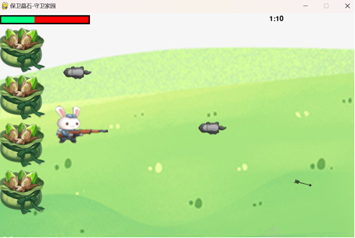

# 保卫晶石-守卫家园 🌟

> **一个基于 Pygame 的简单战斗游戏**  
> 体验守卫城堡与晶石的刺激挑战！

---

## 1. 项目简介 🎮

本项目是一个基于 **Pygame** 设计的简单战斗游戏，作为 Python 程序设计实验的课程大作业。  
游戏主要解决了初始化、用户输入处理、游戏元素更新、碰撞检测以及游戏状态的保存与加载等问题。  
玩家通过鼠标点击进行射击，守卫城堡与晶石，享受简单而富有挑战性的游戏体验。

#### 游戏界面

## 

## 2. 系统要求 🖥️

- **操作系统**：Windows / Ubuntu / macOS
- **Python 版本**：建议 Python 3.7 及以上
- **依赖库**：Pygame 等（详见下文依赖安装说明）

---

## 3. 项目结构 📁

```bash
├── main.py                   # 游戏主程序
├── modules                   # 模块文件夹
│   ├── Sprites.py            # 定义兔子、地鼠、子弹等游戏元素及动作
│   └── interfaces.py         # 定义游戏结束界面及相关接口
├── resources                 # 资源文件夹
│   ├── images                # 游戏所需图片资源
│   └── audio                 # 游戏所需音频资源
├── game_state.txt            # 用于保存与加载游戏状态（准确率）的文件
└── requirements.txt          # 依赖库列表
```

##### 游戏流程

## 

## 4. 安装与运行 🚀

### 4.1 安装依赖 📦

1. 克隆项目到本地后，建议使用虚拟环境管理依赖：
   ```bash
   python -m venv venv
   source venv/bin/activate    # Linux/macOS
   venv\Scripts\activate       # Windows
   ```
2. 安装项目依赖：
   ```bash
   pip install -r requirements.txt
   ```

### 4.2 运行游戏 🎲

在激活虚拟环境后，运行以下命令启动游戏：

```bash
python main.py
```

游戏窗口将自动弹出，按照提示进行操作即可体验游戏的乐趣！

---

## 5. 游戏玩法与功能说明 🎯

- **游戏初始化**：加载窗口、图像、音频资源，并初始化各个游戏模块。
- **用户输入**：支持鼠标点击进行射击操作，点击时播放对应的音效。
- **游戏元素更新**：管理角色（兔子）、敌人（地鼠）与子弹的移动、碰撞检测及生命值计算。
- **状态保存**：游戏结束后自动保存当前射击准确率，方便下次加载或数据统计分析。

---

## 6. 设计总结 📝

- **游戏开发基础**：通过本项目深入学习了 Pygame 的基本用法，包括图形、声音及用户输入处理。
- **面向对象编程**：通过模块化设计和类定义，掌握了编写结构化、易维护代码的方法。
- **文件操作**：实现了游戏状态的保存与加载，增强了对文件操作的理解。
- **调试与优化**：在开发过程中积累了丰富的调试经验，为未来更复杂项目打下坚实基础。

---

🚀 **欢迎 Star & Fork 支持本项目！**  
🚀 **Feel free to star and fork this project!**

---

💖 **感谢您的关注，祝您游戏愉快！** 💖
